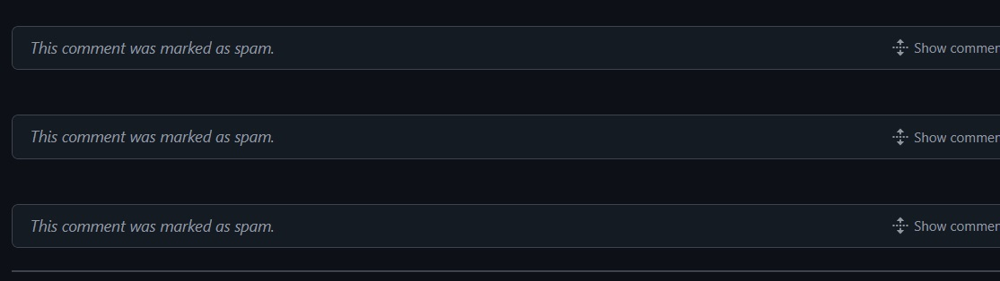

# Auto Hide Spam comments

A GitHub Action to detect and hide spam comments in discussions, issues, and pull requests automatically. This action uses a pre-trained machine learning model to classify and hide spam comments, helping to keep your repository clean.

## Features

- Detects and hides spam comments in discussions, issues, and pull requests.
- Easy to integrate into any repository with customizable inputs(Particular Time/Day/Date).
- Leverages GitHub API authentication for seamless access to repository content.

### Inputs

- **`github_token`** (required): The GitHub token used to authenticate API requests. Use `${{ secrets.GITHUB_TOKEN }}` for secure access to your repository.( You don't have to input anything the code fetches it automatically)

### Output

This action hides spam comments directly in the repository's issues, discussions, and pull requests. No additional output is generated.


## Usage

To use this action in your repository, add the following to your workflow file (e.g., `.github/workflows/spam-detection.yml`).

## Select Any 1 from the workflows below 
### Workflow 1: This will work every time a new comment is commented in Issues/Discussions/Pull Requests.
```yaml
name: Spam Detection
on:
  issue_comment:
    types: [created]
  pull_request_review_comment:
    types: [created]
  discussion_comment:
    types: [created]  
jobs:
  detect-spam:
    runs-on: ubuntu-latest
    permissions:
      issues: write
      pull-requests: write
      discussions: write
      contents: read 
      actions: write  # Important: needed for cache access
    steps:
      - uses: actions/checkout@v3
      
      # Restore cursor cache before running the spam detection
      - name: Restore Cursor Cache
        uses: actions/cache/restore@v3
        id: restore-cursor
        with:
          path: /tmp/cursor_cache.json
          key: ${{ runner.os }}-spam-detection-cursor
          restore-keys: |
            ${{ runner.os }}-spam-detection-cursor
      
      - name: Spam Detection
        uses: Sambhaji-Patil/Auto-Hide-Spam-Comments@v1.2 
        env:
          GITHUB_TOKEN: ${{ secrets.GITHUB_TOKEN }}
      
      # Save cursor cache after running spam detection
      - name: Save Cursor Cache
        uses: actions/cache/save@v3
        with:
          path: /tmp/cursor_cache.json
          key: ${{ runner.os }}-spam-detection-cursor-${{ github.sha }}
```

## Cron Expression Customization:

The cron expression 0 * * * * represents:

- Minute: 0
- Hour: Every hour (*)
- Day of the month: Every day (*)
- Month: Every month (*)
- Day of the week: Every day of the week (*)

## Use below types and replace in the main code above

### Workflow 2: This will work every 3 hours.
```yaml
name: Spam Detection

on:
  schedule:
    - cron: '0 */3 * * *'  # Run every 3 hour
  workflow_dispatch: # Allows you to manually trigger the workflow as needed. 

```

### Workflow 3: This will work every day at 9AM.
```yaml
name: Spam Detection

on:
  schedule:
    - cron: '0 9 * * *'  # Run every day at 9AM.
  workflow_dispatch: # Allows you to manually trigger the workflow as needed. 

```

### Workflow 4: Every weekday (Monday-Friday) at 5 PM
```yaml
name: Spam Detection

on:
  schedule:
    - cron: '0 17 * * 1-5'  # Every weekday (Monday-Friday) at 5 PM
  workflow_dispatch: # Allows you to manually trigger the workflow as needed.
```

### Workflow 5: First day of every month at 2 AM
```yaml
name: Spam Detection

on:
  schedule:
    - cron: '0 2 1 * *'  # First day of every month at 2 AM
  workflow_dispatch: # Allows you to manually trigger the workflow as needed. 

```

### Workflow 6: Run every Monday at 9:00 AM
```yaml
name: Spam Detection

on:
  schedule:
    - cron: '0 9 * * 1'  # Run every Monday at 9:00 AM
  workflow_dispatch: # Allows you to manually trigger the workflow as needed. 

```

## How It Works

The action leverages a machine learning model to classify comments as "spam" or "not spam" based on text content. If a comment is classified as spam, it will be automatically hidden in the relevant thread.

## Requirements

- **Python 3.8+** (bundled in the action environment)
- **GitHub Token** with `repo` permissions

## Development

To test the action locally or modify it:
1. Clone the repository.
2. Update the model or code as needed.
3. Use `act` to simulate GitHub Actions locally (recommended for testing).

```bash
act -j spam-detection
```
